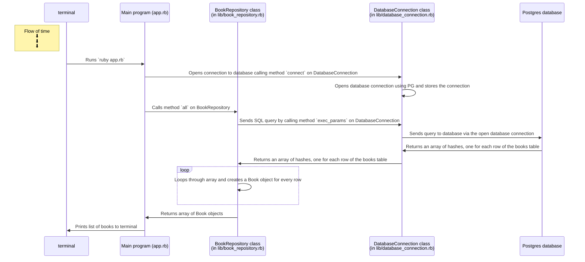

# Book Store Model and Repository Classes Design Recipe

## 1. Design and create the Table




## 2. Create Test SQL seeds

## 3. Define the class names

```ruby
# EXAMPLE
# Table name: books

# Model class
# (in lib/book.rb)
class Book
end

# Repository class
# (in lib/book_repository.rb)
class BookRepository
end
```

## 4. Implement the Model class


```ruby
# EXAMPLE
# Table name: books

# Model class
# (in lib/book.rb)

class Book
  attr_accessor :id, :title, :author_name
end

```


## 5. Define the Repository Class interface

```ruby
# EXAMPLE
# Table name: books

# Repository class
# (in lib/book_repository.rb)

class BookRepository

  # Selecting all records
  # No arguments
  def all

    # Executes the SQL query:
    # SELECT id, title, author_name FROM books;

    # Returns an array of Book objects.
  end

  def all_list
    # Returns a list of Book objects
    # In the form:

    # 1 - Nineteen Eighty-Four - George Orwell
    # 2 - Mrs Dalloway - Virginia Woolf
    # 3 - Emma - Jane Austen
    # 4 - Dracula - Bram Stoker
    # 5 - The Age of Innocence - Edith Wharton)
  end

end

```

## 6. Write Test Examples

These examples will later be encoded as RSpec tests.

```ruby
# EXAMPLES

# 1
# Get all books

repo = BookRepository.new

books = repo.all

books.length # =>  2

books[0].id # =>  1
books[0].title # =>  'Nineteen Eighty-Four'
books[0].author_name # =>  'George Orwell'

books[1].id # =>  2
books[1].title # =>  'Mrs Dalloway'
books[1].author_name # => 'Virginia Woolf'

```

Encode this example as a test.

## 7. Reload the SQL seeds before each test run


## 8. Test-drive and implement the Repository class behaviour

