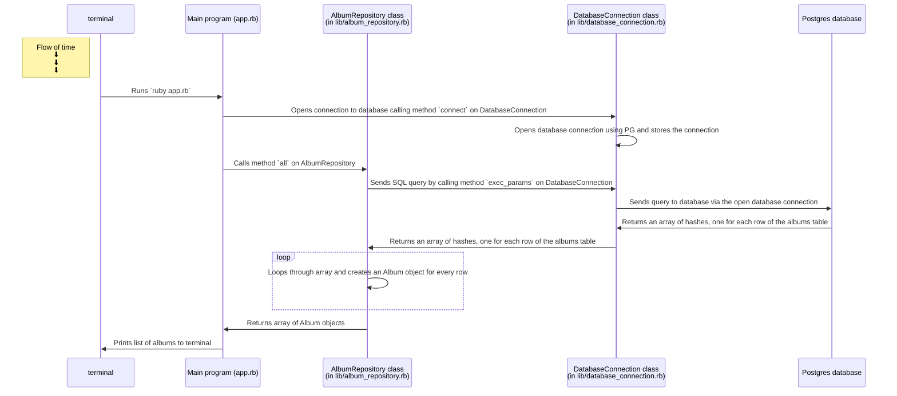

# Music Library Database Model and Repository Classes Design Recipe


## 1. Design and create the Table

Table is already created in the database.




## 2. Create Test SQL seeds

```sql

TRUNCATE TABLE artists RESTART IDENTITY;
TRUNCATE TABLE albums RESTART IDENTITY;

INSERT INTO artists (name, genre) VALUES ('Pixies', 'Rock');
INSERT INTO artists (name, genre) VALUES ('Imagine Dragons', 'Pop Rock');


INSERT INTO albums (title, release_year, artist_id) VALUES ('Surfer Rosa', 1988, 1);
INSERT INTO albums (title, release_year, artist_id) VALUES ('Doolittle', 1989, 1);
INSERT INTO albums (title, release_year, artist_id) VALUES ('Smoke + Mirrors', 2014, 2);

```

```bash
psql -h 127.0.0.1 music_library_test < ./spec/seeds_albums.sql
```

## 3. Define the class names

(for Albums)

```ruby
# EXAMPLE
# Table name: students

# Model class
# (in lib/album.rb)
class Album
end

# Repository class
# (in lib/album_repository.rb)
class AlbumRepository
end
```

## 4. Implement the Model class

(for Albums)

```ruby

# Table name: albums

# Model class
# (in lib/album.rb)

class Album

  attr_accessor :id, :title, :release_year, :artist_id

end

```


## 5. Define the Repository Class interface

(for Albums)

```ruby

# Table name: albums

# Repository class
# (in lib/album_repository.rb)

class AlbumRepository

  def all
    # Executes the SQL query:
    # SELECT id, title, release_year, artist_id FROM albums;

    # Returns an array of Album objects.
  end

  def find(id)
    # Performs a SELECT query and returns a single Album object. (depending on the id)
  end

end
```

## 6. Write Test Examples

These examples will later be encoded as RSpec tests.

```ruby
# EXAMPLES for ALBUMS

# 1
# Get all albums

repo = AlbumRepository.new
albums = repo.all

albums.length # => 3
albums.first.title # => 'Surfer Rosa'
albums.first.release_year # => '1988'
albums.first.artist_id # => '1'

#2
# Returns empty when there are no albums in the database

repo = AlbumRepository.new
#(all albums are removed after set up)
albums = repo.all # => []

#3
# Returns a single Album object that corresponds with the id requested

repo = AlbumRepository.new
album = repo.find(3)

album.title # => 'Smoke + Mirrors'
album.release_year # => '2014'
album.artist_id # => '2'

#4
# Adds an album to the database when the create method is used

repo = AlbumRepository.new
album = Album.new

album.title = 'Trompe le Monde'
album.release_year = 1991
album.artist_id = 1

repo.create(album)
albums = repo.all

albums.last.title # => "Trompe le Monde"
albums.last.release_year # => "1991"
albums.last.artist_id # => "1"


# EXAMPLES for ARTISTS

# 1
# Get all artists

repo = AlbumRepository.new
albums = repo.all

albums.length # => 3
albums.first.title # => 'Surfer Rosa'
albums.first.release_year # => '1988'
albums.first.artist_id # => '1'

#2
# Returns empty when there are no artists in the database

repo = ArtistRepository.new
#(all artists are removed after set up)
artists = repo.all # => []


```

## 7. Reload the SQL seeds before each test run


## 8. Test-drive and implement the Repository class behaviour
