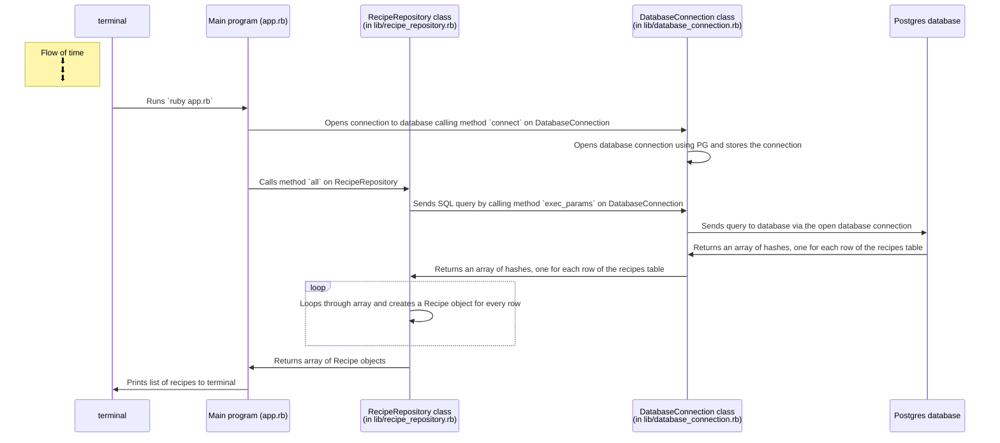

# Single Table Design Recipe (recipes_directory)


## 1. Extract nouns from the user stories or specification

```
# USER STORY:

As a food lover,
So I can stay organised and decide what to cook,
I'd like to keep a list of all my recipes with their names.

As a food lover,
So I can stay organised and decide what to cook,
I'd like to keep the average cooking time (in minutes) for each recipe.

As a food lover,
So I can stay organised and decide what to cook,
I'd like to give a rating to each of the recipes (from 1 to 5).
```

```
Nouns:

recipe, name, cooking time, rating
```

## 2. Infer the Table Name and Columns


| Record                | Properties                 |
| --------------------- | -------------------------- |
| recipe                | name, cooking time, rating |

Name of the table: `recipes`

Column names: `name`, `cooking_time`, `rating`

## 3. Decide the column types.

```
id: SERIAL
name: text
cooking_time: int
rating: int
```

## 4. Write the SQL.

```sql
-- file: recipes.sql

CREATE TABLE recipes (
  id SERIAL PRIMARY KEY,
  name text,
  cooking_time int,
  rating int
);
```

## 5. Create the table.

```bash
psql -h 127.0.0.1 recipes_directory < recipes.sql
```


# Recipes Directory Classes Design Recipe

## 1. Design and create the Table

(all method)


## 2. Create Test SQL seeds

## 3. Define the class names

```ruby
# EXAMPLE
# Table name: recipes

# Model class
# (in lib/recipe.rb)
class Recipe
end

# Repository class
# (in lib/recipe_repository.rb)
class RecipeRepository
end
```

## 4. Implement the Model class


```ruby
# Table name: recipes

# Model class
# (in lib/recipe.rb)

class Recipe
  attr_accessor :id, :name, :cooking_time, :rating
end

```


## 5. Define the Repository Class interface

```ruby
# Table name: recipes

# Repository class
# (in lib/recipe_repository.rb)

class RecipeRepository

  # Selecting all records
  # No arguments
  def all

    # Executes the SQL query:
    # SELECT id, name, cooking_time, rating FROM recipes;

    # Returns an array of Recipe objects.
  end

  def find(id)
    # Performs a SELECT query and returns a single Recipe object. (depending on the id)
  end

end

```

## 6. Write Test Examples

These examples will later be encoded as RSpec tests.

```ruby
# 1
# Get all recipes

repo = RecipeRepository.new
recipes = repo.all

recipes.length # => 3
recipes.first.name # => 'Spaghetti Bolognese'
recipes.first.cooking_time # => 110
recipes.first.rating # => 5

#(etc.)

#2
# Returns a single Recipe object that corresponds with the id requested

repo = RecipeRepository.new
recipe = repo.find(1)

recipe.name # => 'Spaghetti Bolognese'
recipe.cooking_time # => 110
recipe.rating # => 5

```


## 7. Reload the SQL seeds before each test run


## 8. Test-drive and implement the Repository class behaviour

